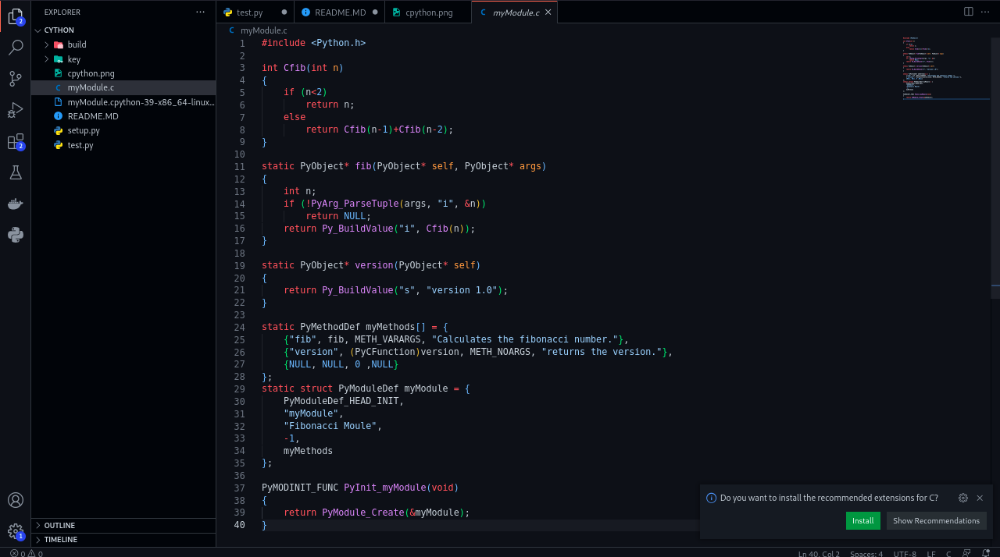

# CPython programm
# 
CPython est l'implémentation de référence du langage Python et l'implémentation par défaut et la plus largement utilisée de ce langage. CPython peut être défini à la fois comme un interpréteur et un compilateur, car il compile le code Python en bytecode avant de l'interpréter

## Constitution du projet CPYTHON
Pour sa mise sur pieds nous avons besoin de creer deux fichiers python
l'une pour les configuration(`Setup.py`) et le programme principal et d'un programme ecrit en `C` definissant les fonctions a execute

# 